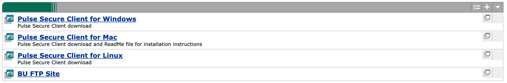

### Table of Contents  

 1. [Connect from Off-Campus Network](#off_campus)
     * [Installing Pulse Client](#vpn)
 2. [Using Windows](#using_windows)  
     * [Install SSH Client \(PuTTY\)](#windows_ssh) 
     * [Connected to University Network](#using_windows)  
 3. [Using Mac](#using_mac)
     * [Connected to University Network](#using_mac) 
 4. [Using Linux](#using_linux)  
     * [Connected to University Network](#using_linux)  
 5. [Changing Your Password](#passwd_chng)
 6. [Accessing Bright Web Portal](#bright_web)
 7. [X2Go on Spiedie](#x2go)


## <a name="off_campus"></a>Connect from off-site internet / remote connection 

***Note: Take the following steps if logging in from an off-campus network***

First and foremost, you can only connect to the spiedie cluster when you are using the campus network. If you're off campus and need to connect, you can do so by first connecting to the campus network through a virtual private network (VPN). Luckily, Binghamton University provides information on using a VPN called Pulse Secure.

#### <a name="vpn"></a> Install Pulse Secure VPN

Go to <a href="https://ssl.binghamton.edu" target = "_blank">ssl.binghamton.edu</a> and log in using your PODS DOMAIN ID. 


Once you're logged in, you should see options for downloading Pulse Secure depending on which system you are using. Select the appropriate option and follow the given instructions.




***Note: The following instructions are for when you are connected to the campus network. If you are off campus you must be connected through Pulse Secure.***


## <a name="using_windows"></a> Using Windows


#### <a name="windows_ssh"> </a>Install a SSH client

First we need to install an ssh client. We will be using <a href="https://www.putty.org" target="_blank">PuTTY</a> for this tutorial. 

<a href="https://www.ssh.com/ssh/putty/windows/install" target="_blank">Follow these instructions to get PuTTY running on your windows machine</a>
   
1. Open a new PuTTY session
2. Type in your *username*@spiedie.binghamton.edu in the Host Name (or IP address) text field 
	
	<!--- (Add image of putty terminal to help user)
	(image#1)
	Caption: putty log in --->
3. Click Open or press enter
4. Type in password (your typed characters will remain hidden on the screen)

 


## <a name="using_mac"> </a> Using Mac or Linux <a name="using_linux"> </a>


1. Open a new terminal window.
2. Type in the following command and press enter:
	``` shell
	ssh username@spiedie.binghamton.edu
	```
	replace `username` with your Spiedie username
3. If this is your first time connecting, type yes and press enter to recognize the ssh fingerprint.
4. Enter password when prompted.

## <a name="passwd_chng"></a> Changing Your Password

The first thing you should do when connecting for the first time is change your password. The password provided with your account is not unique, and unless you change it your account may not be secure.

You can change your password by using the `passwd` command. Type

```bash
[@spiedie81 ~]$ passwd
Old SMB password:
New SMB password:
Retype new SMB password:
Password changed for user 
[watson@spiedie81 ~]$ 
```
When you enter the `passwd` command, your are prompted to enter your current password, then your new password. Once done, your password is successfully changed.


## <a name="bright_web"></a> Accessing Bright Web Portal
Spiedie uses the Bright Computing cluster manager. You can also check the status of clusters on a web portal by login in with Spiedie username and password. (Note: This is not the same as your PODS account)

<a href="https://spiedie.binghamton.edu/userportal/" target="_blank">Click here to log into the web portal (must be on campus-network)</a>

## <a name="x2go"></a> Accessing Spiedie via X2Go

*** [Click here for a tutorial on how to connect to Spiedie via X2Go](x2go_spiedie.html)***
