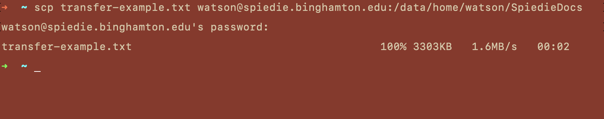
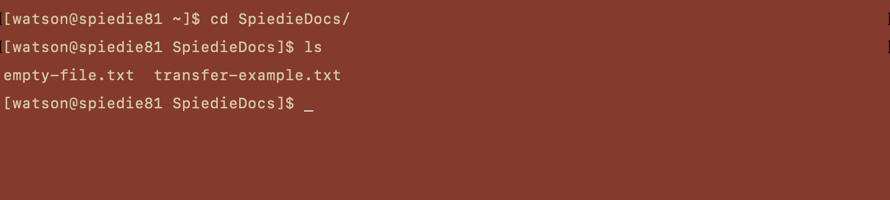
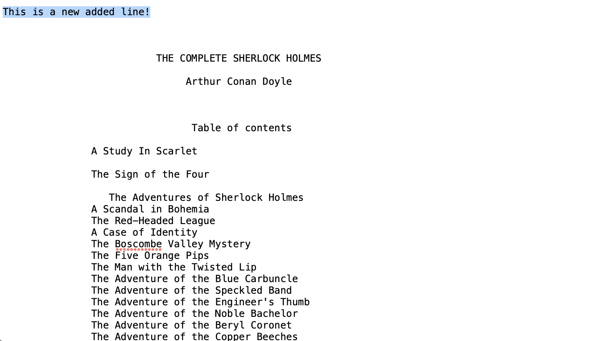
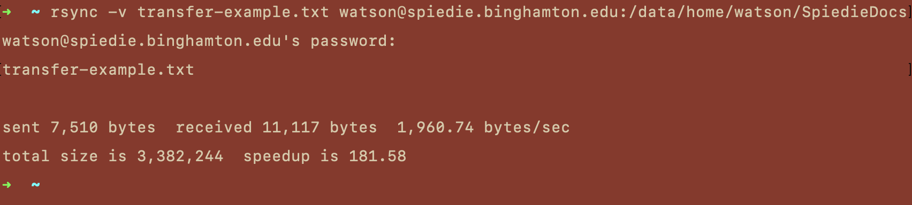
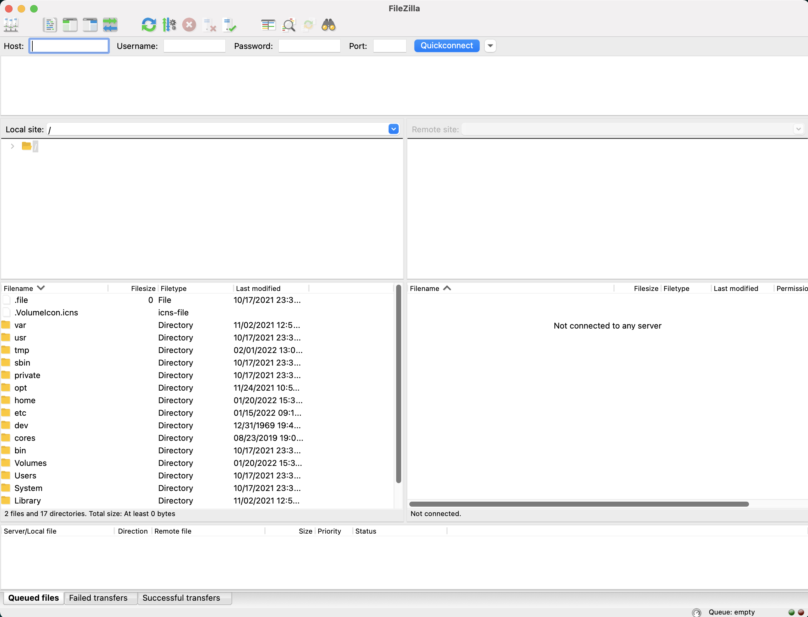
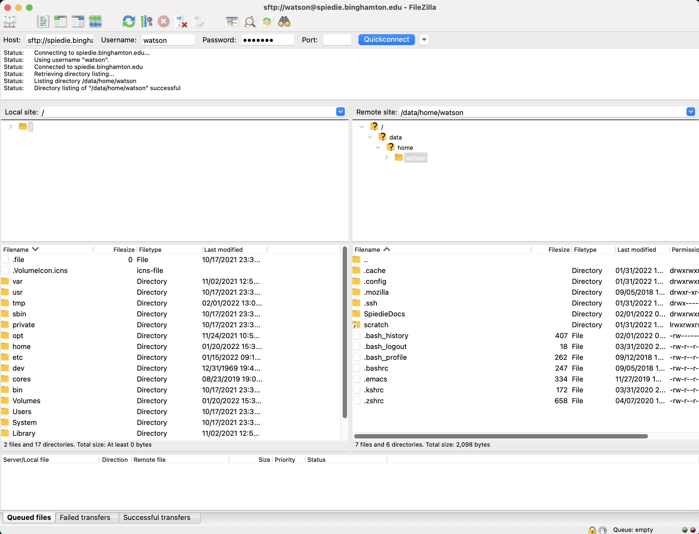

### Table of Contents 

1. [Using SCP](#SCP)
2. [Using RSYNC](#rsync)
3. [Map Home Directory](#Home_dir)
    * [Windows](#windows_map_home)
    * [Mac](#mac_map_home)
    * [Linux](#linux_map_home)

<hr/>
As stated in previous sections, the Spiedie cluster should really only be used for running jobs, storing only the data necessary for those jobs. Everything else should be moved off the cluster as early as possible. This prevents hogging the available memory on Spiedie and also protects you're data from being deleted in the case of system error. 

We will look at two ways of moving data to and form the cluster, **scp** and **rsync**. To get started, first download the bash file, <a href="../download/transfer-example.txt" download>transfer-example.txt</a>. This file contains the complete Sherlock Holmes literature, if you're interested in a good read.

***Note: The following steps are only applicable while connected to the university network. If working off-campus, you must connect first to a SSL VPN. [Click here for more details](connect-to-spiedie.html)*** 


## <a name="SCP"></a> Using SCP to Transfer Files 

SCP (secure copy) is a command-line utility that allows you to securely copy files and directories between two locations.  

``` bash
scp source.ext <username>@spiedie.binghamton.edu:path/to/destination
``` 
Lets look at the components of the scp command:

* `source.ext` is the file you wish to transfer to the remote server.
* `<username>` is the username of your spiedie cluster account.
* `path/to/destination` is the path to the directory you want to transfer to.

One important note to remember is that you need to give the full path of the directory on the cluster. We can start by transferring the *transfer-example.txt* file downloaded earlier into the *SpiedieDocs* directory created in the last section, using the full path of the directory which we can find by **cd**ing into the directory and using the **pwd** command.



The output of **scp** will show you the files transferred, as well as their transfer completion, size, transfer speed and time. We can use flags to augment the output and the behavior of the scp command, but for now we will take note of the 448KB file transfer size.

Now when you look in the *SpiedieDocs* directory on the cluster you'll see that the file has been transferred.



Transferring a file from the Spiedie cluster to your local computer is just as simple. From your local computer just use the **scp** command except now the *source* is the path to your file(s) on Spiedie and the *destination* is the path to the directory on your local computer.

#### Transferring a Directory to Spiedie Cluster

This is similar to transferring a single file except instead of specifying a file, we specify a directory, `local-directory`, and we add the `-r` flag which tells scp that we are trying to transfer a directory.

``` bash 
scp -r local-directory <username>@spiedie.binghamton.edu:your/desired/destination
```
More information on SCP can be found <a href='https://linuxize.com/post/how-to-use-scp-command-to-securely-transfer-files/' target="_blank">here</a>.


## <a name="RSYNC"> </a> 2.2.2 Rsync

Similar to SCP, Rsync can also be used to transfer files and folders using the terminal. Rsync differs in that only the portions of the files that have been changed are transferred, minimizing the total amount of data transferred.

Use Rsync when:
  * You are transferring large files.
    * In case of network connection failure mid transfer.
    * The entire file does not need to be transferred, only the parts that changed.
  * When keeping remote and local directories synced.
    * Using the rsync command to sync the directories will only transfer the changed files.

``` bash 
rsync file.ext <username>@spiedie.binghamton.edu:your/desired/directory 
```

Lets test the **rsync** command by first editing the *transfer-example.txt* file on your local computer. Add a line to the end of the file that looks something like this...




Once you've saved your file you can sync it to Spiedie using **rsync**.



You can see a significant speedup due to only needing to transfer the changes to the file, and not the entire thing.


**rsync** has plenty of flags you can use to manipulate its function. A good resource for can be found <a href='https://www.digitalocean.com/community/tutorials/how-to-use-rsync-to-sync-local-and-remote-directories' target="_blank">here</a>.


## <a name= "Home_dir"> </a>2.2.3 Mapping Home Directory

If you prefer to use a graphical interface to access your files you can map your Spiedie home directory. There are a couple different solutions for this, depending on your operating system.***NOTE: Just as above, you must be connected to the campus network either directly or through pulse secure***

#### <a name="windows_map_home"> </a> Windows Explorer
1. Open a new windows explorer to PC.
2. Click on the computer option on the taskbar and select Map network drive.
3. Select folder letter and paste ```\\spiediefiles.binghamton.edu\username``` to the folder text field. 
4. Make sure to select 'Use different credentials' and click finish.
5. Use Spiedie user name and password for your credentials.

#### <a name="linux_map_home"> </a> Linux File System Viewer (Ubuntu)
1. Open a new system files window.
2. Click on other locations.
3. Enter ``` smb://spiediefiles.binghamton.edu/username``` for the server address, replacing your user name for username and click connect.
4. Click on registered users and use your user name and password to mount the network drive.

#### <a name="mac_map_home"></a> MacOS / OS Agnostic Directory Mapping (FileZilla)

Mapping your directory on MacOS is not as simple as on Windows or Linux. The best way to map using a GUI is to install and use <a href='https://filezilla-project.org/' target='_blank'>FileZilla</a>. The FileZilla Client not only supports FTP, but also FTP over TLS (FTPS) and SFTP. It is open source software distributed free of charge under the terms of the GNU General Public License.

Once you've installed FileZilla and open it, you should be greeted with a view like the following image.



At the top of the window there are fields to enter you remote information, and in the lower left hand window you should see your local file system. You connect to your Spiedie file system by entering your information in the following fields...


**Host:** sftp://\<username>@spiedie.binghamton.edu 

**Username:** \<username> 

**Password:** \<password> 

**Port:** Not necessary for basic connection

After you've entered your info, you should see the the connection status being printed below the fields. Once a connection has been established you should see your Spiedie file system in the lower right hand window. 


Transferring files is then as simple as dragging and dropping from one file system to the other.

Now that we've gone over transferring data to and from the Spiedie cluster, we can start thinking about using the resources Spiedie provides to actually run some jobs!


