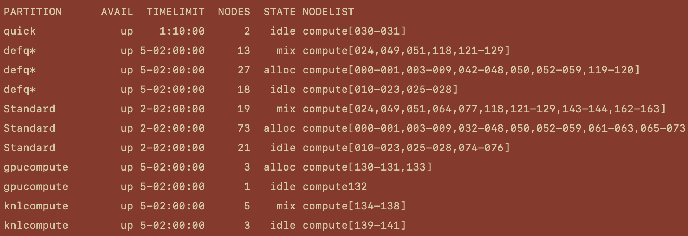

### Table of Contents  

 1. [Cluster Information](#sinfo)  
     * [PARTITION](#partition) 
     * [AVAIL](#avail)  
     * [TIMELIMIT](#timelimit)
     * [NODES](#nodes)
     * [STATE](#state)
     * [NODELIST](#nodelist)
 2. [Queue Information](#squeue)
     * [JOBID](#jobid) 
     * [PARTITION](#squeue-partition)
     * [NAME](#name)
     * [STATE](#state)
     * [TIME](#time)
     * [NODES](#squeue-nodes)
     * [NODELIST(REASON)](#nodelist)


## <a name="sinfo"></a> Cluster Information

 When you are logged in, you can see the current state of the cluster using the **sinfo** command. In the terminal after you've logged in type

 ```bash
 sinfo
 ```

 This will give you an output similar to below.

 

 Lets break down this output and look at the columns individually.
 
#### <a name="partition"></a> PARTITION

The first column in this output lists the partitions available on the cluster. While it would be possible to have a single partition which services the entire cluster, it's much more convenient to pool nodes with similar resources into individual partitions.  The nodes on Spiedie are partitioned into 4 distinct sets depending on the resources available.  

| Partition Name | Partition Detail|
| --- | --- |
|**Quick** |  For programs with short run times. Ideal for testing out your code as queue remains small due to the 10 min time restriction of the partition. Use this partition for jobs that will finish immediately and you need the results right away. |
|**DefQ**| Default queue nodes are the default compute nodes used if when no partition is specified. The cluster will allocate 4GB of RAM for each job and allows for a 122 hour time limit. Currently there are 960 CPUs and 58 total nodes in the DefQ partition. If you do not need specialized hardware (i.e. GPU) or massive multi-core support and high memory( > 16 cores), these partitions are ideal. |
|**Standard**| The Standard partition has more nodes and cores available than Defq, however has a 50 hour time limit for running jobs. It has a default 4GB of RAM allocated per CPU requested. There are 2824 CPUs and 141 total nodes in this partition, but be aware that this number can fluctuate depending on if a researcher has requested temporary exclusive priority on their node.
|**Knights Landing**| The Knights Landing partition contains the nodes with 64 cores per socket and 4 threads per core Xeon phi cpus. The partition should be used for extremely multithreaded tasks that really on parallel computation (like openMP) and not message parsing (MPI).| 
|**GPU**|The GPU partition nodes contain NVidiaP100 GPU's for CUDA-accelerated programs. These nodes should only be primarily used for GPU-accelerated programming. Each node contains a 12 GB P100 GPU with 28 available cores and 128 or 256 GB of memory. Although you are able to run non-GPU accelerated code on these nodes, it is best practice to not do so in order to not bottleneck users trying to use the GPU's.|

#### <a name="avail"></a> AVAIL

The next column displays the status of that partition. Usually the partition can be **up** or **down**.

| Status Name | Status Detail |
| --- | --- |
|**UP**| The partition is operating normally|
|**DOWN**|The node is unavailable for use. SLURM can automatically place nodes in this state if some failure occurs. System administrators may also explicitly place nodes in this state.|


####  <a name="timelimit"></a> TIMELIMIT 

Each partition has a time limit for the jobs being run on it. This limit is usually displayed in the format of **DD-HH:MM:SS**. What this means is that if your submitted job is not completed in that time limit, then it will automatically be killed when the limit is up. For instance, the **defq** partition has a time limit of **5-02:00:00**, which means that after 5 days and 2 hours your job will be killed if not yet finished.

####  <a name="nodes"></a> NODES

This column displays the number of individual nodes of the same state (discussed next). Looking at the PARTITION column you would see that "Standard" is listed three times. This doesn't mean that there are three different "Standard" partitions, rather that the nodes withing the partition can be grouped into three distinct states. This will be more clear in a moment.

####  <a name="states"></a> STATE

Each node that makes up the cluster can be thought of as an individual computer, with its own CPU/s, cores, memory, etc.. When you submit a job to run on the cluster you specify the resources that your job will need, and the resource allocation of a partition is given in the column. The states that you will like see are as follows.

|State Name| State Detail|
|---|---|
|**ALLOCATED (ALLOC)** | The node is allocated to one or more jobs. New jobs wont run on this node until the current jobs finish|
|**DOWN**| The node is currently unavailable for use. This may be a result of some failure occurring, or administration intervention.|
|**DRAINED**| The node is unavailable for use per system administration request.|
|**DRAINING**| The node is currently executing a job, but will not be allocated to additional jobs. When the last job is completed, the node state will be changed to *DRAINED*.|
|**IDLE**| The node is not allocated to any job and is available for use.|
|**MIXED**| The node has some of its CPUs allocated while others are available to receive jobs.|

####  <a name="nodelist"></a> NODELIST

At the time of this writing the spiedie cluster contains 170 nodes. Each node has an associated name such as "compute000" or "compute150" where the number following "compute" is the node's unique identifier. The *NODELIST* column tells you which nodes are in the accompanying state.

For example, the nodes in the **defq** partition that are currently idle are compute[014-020], meaning that compute014, compute015, compute016, compute017 , compute018, compute019 , and compute020 are currently idle. This could be useful if you need a job to run soon, as you can specify which nodes to rin your job on when you submit.  

## <a name="squeue"></a> Queue Information

When you submit a job to the cluster it isn't guaranteed to run immediately. The slurm cluster uses whats called a scheduler, which determines the job's position in the queue based on variety of factors. Modern schedulers provide a fairness component, which gives advantage to under-serviced users, and jobs which require fewer resources or less time to run.

You can see the state of the queue by using the **squeue** command. In the terminal, type..

```bash
squeue
```
After typing the command, you should see an output like this.


This output shows the current jobs running/waiting on the cluster. We'll look at the individual columns of this output, like we did with the **sinfo** output.

#### <a name='jobid'></a> JOBID

Each submitted job is given a specific job id from the cluster. This id would be used to alter the job, whether it is to cancel, suspend, etc.. We'll talk more about submitting and manipulation jobs in a later section.

#### <a name='squeue-partition'></a> PARTITION

This displays the partition that the job is running on.

#### <a name='name'></a> NAME

The name of a job is one you would supply when you submit your job. This makes it easier for you to manage your current running jobs.

#### <a name='user'></a> USER

The name of the user who submitted the job.

#### <a name='state'></a> STATE

When you submit a job, it goes through a couple different states throughout its life-cycle/ The current state of the job is given in the *ST* column. Some common states you'll see are...

| State Abbreviation |State Name| State Description |
|---|---|
|**PD**| **PENDING**| Job is awaiting resource allocation|
|**R**| **RUNNING**| Job currently has an allocation and is running|
|**ST**|**STOPPED**| Job has an allocation, but execution has stopped with SIGSTOP signal. CPUs have been retained by this job|
|**S**|**SUSPENDED**| Job has an allocation, but execution has been suspended and CPUs have been released for other jobs|
|**TO**|**TIMEOUT**| Job terminated upon reaching its time limit|
|**F**| **FAILED**| Job terminated with non-zero exit code or other failure condition|
|**CG**| **COMPLETING**| Job is in the process of completing, Some processes on some nodes may still be active|
|**CD**| **COMPLETED** | Job has completed and has terminated all processes on all nodes with an exit code of zero|

#### <a name="time"></a> TIME

The *TIME* column displays the amount of time a job has been running. You will see that pending jobs have a time of 0:00, while some jobs have been running for months. Looking at the *PARTITION* and *TIME* columns will give you a good indication of the future state of the cluster given the *TIMELIMIT* of each partition.

#### <a name="squeue-nodes"></a> NODES

The *NODES* column is pretty self-explanatory. It shows the number of nodes each job requested.

#### <a name="node-list"></a> NODELIST(REASON)

This column's content depends on the state of the job. When the job is running normally, this column will list the nodes the job is running on. For other states, this column will display the reason why it is in the current state. For the sake of brevity, only common reasons for the pending state are listed.

|Common PD Reasons| Description|
|---|---|
| **Dependency** | This job is waiting for a dependent job to complete|
| **Priority** | One or more  higher  priority  jobs  exist  for  this  partition  or advanced reservation|
|**Resources**| The job is waiting for resources to become available|


