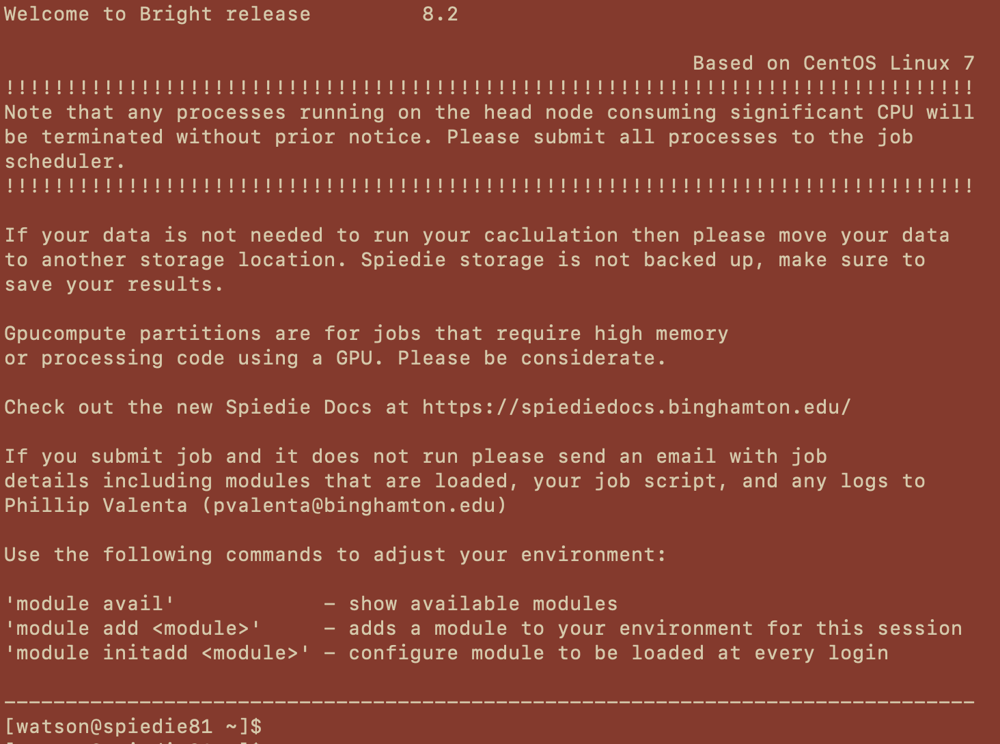
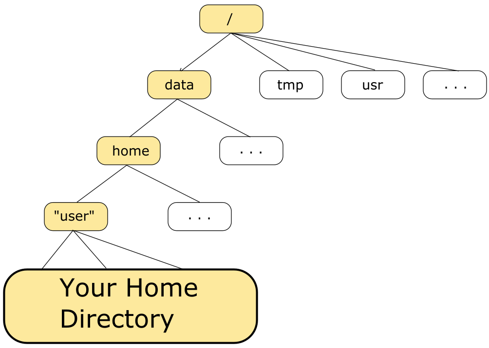
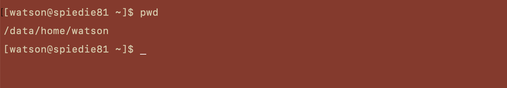
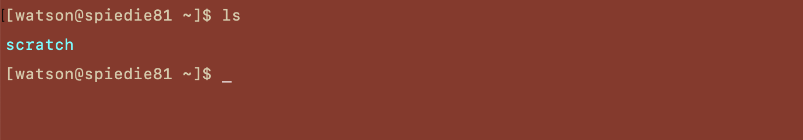
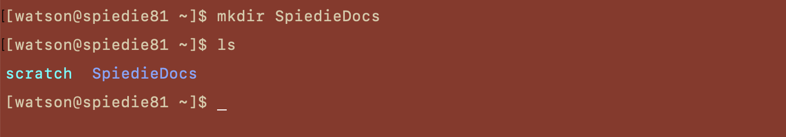
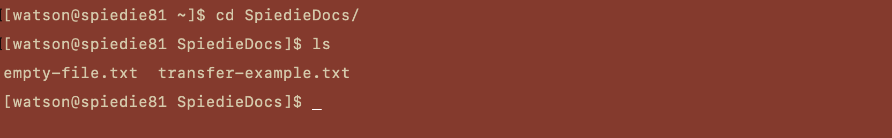
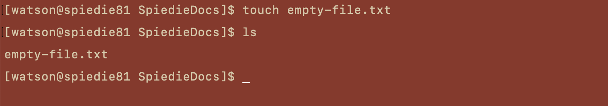

### Table of Contents  

 1. [Welcome to Spiedie](#welcome-message)
 2. [Your Spiedie Environment](#your-environment)  
     * [The UNIX OS](#unix) 
     * [Your Home Directory](#your-home)  
     * [Creating New Files and Directories](#createDirectory)
    


## <a name="welcome-message"></a>  Welcome to Spiedie

 Everytime you log into Spiedie you will be greeted with a welcome message similar to the one below.

 

 This message contains some information you will need to use the cluster. 
 
 Firstly is a reminder of the first rule of Spiedie...***Don't run significant processes on the head node!***. The reason for this is that every user logs in to the head node, it is design for low resource operations like file system manipulation, creating run files, etc..

 Next is a warning about storing youre data. Situations can arise when issues with the cluster may cause data to be deleted. While the maintainers of Spiedie work tirelessly to prevent this from happening, nothing is perfect. ***Move all crucial, non-operational data off of spiedie as soon as possible!*** Ideally you should back up everything you have on Spiedie frequently.

 The GPUCompute partition is mentioned next, but this can be applied to any partition. It's a good idea to understand the details of the jobs you're running, such as memory usage, CPU usage, GPU usage, etc.. Not only will this help you optimize for the current needs of your job, but it will also keep partitions and resources available for those who need it.

 Towards the bottom of the message is information about the current modules and how to include that in your environment. More on that later.

 ***You should always check the welcome message when you log in. In addition to the information described above, important information about the current and future state of Spiedie will be included here, such as future maintenance or outages. Nobody wants their job to be cancelled because they ignored these notices!***

## <a name='your-environment'></a> Your Spiedie Environment

### <a name='unix'></a> The UNIX OS

Most people who use computers are used to using a Graphical User Interface (GUI), whether its using Windows OS or MacOS (which is actually a variety of UNIX). This is your normal point and click interface, where you can click on an application to run it, or click on you files to navigate them. The spiedie cluster is built on a UNIX OS, but it does not have a GUI, instead it has a shell, essentially a window in which you type all the commands you wish to execute. The shell is a command line interpreter (CLI). 

After logging into Spiedie, you are automatically in Spiedie's bash shell. Bash is just a type of CLI which has certain features that help the user inputting commands. Essentially everything you do on Spiedie will be using the shell, so it important you understand how it is used.

Everything you do can be reduced to either manipulating files or running processes.

A file is any collection of data which can either be created by the user or generated using compilers, etc.. 

A process is an executing program identified by a unique process identifier (PID).


### <a name='your-home'></a> Your Home Directory

Everything in UNIX is either a file or a process. These files and processes are grouped together and stored in a directory structure, a hierarchical structure similar to an inverted tree. An example is shown below.



Instead of *"user"* in the figure above, the directory will be your spiedie username. You can view the path to your current home directory by using the *print working directory* command **pwd** in the terminal. You can do this by typing 

```bash
pwd
```
at the command prompt. You shuold get an output which looks like the below figure.



You can learn more about the unix command **pwd**, as well as other commands youll use shortly by checking out the linux command page of these [docs](basic_linux_commands.html)

### <a name='create-directory'></a> Creating New Files and Directories

Your home directory is where you will be keeping all of your data. You can view the contents of you current directory by using the **ls** command. Type



If you havent yet created any files or folder, then the output of the ls command wont show much. The output will list just one directory, which is the *scratch* directory and is mainly used for temporary files.

Lets go about populating out home directory. We can creat new directories by using the **mkdir** command followed by the name we want to give our directory. Then we can us **ls** again to show that it was created.



Once we've created the *SpiedieDocs* directory we can navigate to it using the **cd** command. We can confirm this change by again printing the current working directory.



Now thate we've moved into the *SpiedieDocs* directory, lets create a file. There are a number of ways to create a file, we can use a text editor, such as [emacs or vi](basic_linux_commands.html#editors), or we can create an empty file without adding contents by using the *touch* command.



You can check that your file was created by using the *ls* command.

You can learn more about creating and manipulating files and directories [here](basic_linux_commands.html#manipulating_files_directories).


